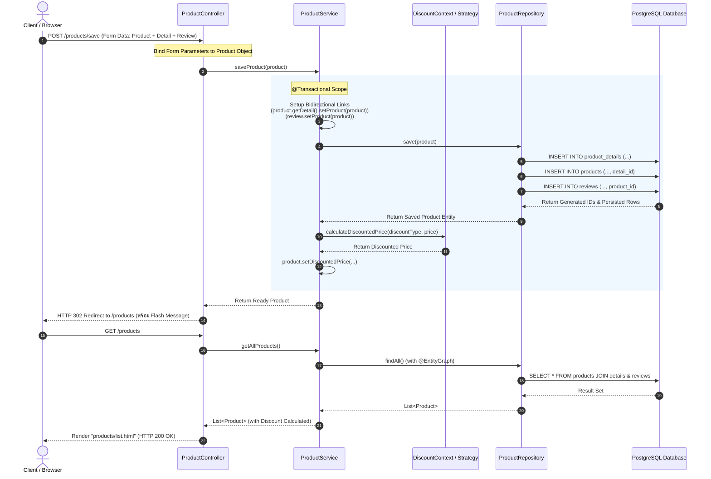

# 📄 รายงานสรุปผลการปฏิบัติการ Lab 8: Table Relationships
**วิชา:** CP353002 Principles of Software Design  
**เรื่อง:** ความสัมพันธ์ตาราง 1:1 และ 1:N ด้วย Spring Boot + JPA + PostgreSQL  

---

## 📑 สารบัญ
1. [ส่วนที่ 1: หลักการออกแบบ (Design Principles)](#ส่วนที่-1-หลักการออกแบบ-design-principles)
   - [1.1 การประยุกต์ใช้ SOLID Principles กับการออกแบบ Entity และสถาปัตยกรรม](#11-การประยุกต์ใช้-solid-principles-กับการออกแบบ-entity-และสถาปัตยกรรม)
   - [1.2 ความแตกต่างระหว่างความสัมพันธ์ 1:1 กับ 1:N และเกณฑ์การเลือกใช้งาน](#12-ความแตกต่างระหว่างความสัมพันธ์-11-กับ-1n-และเกณฑ์การเลือกใช้งาน)
   - [1.3 การประยุกต์ใช้ Strategy Pattern สำหรับคำนวณส่วนลด](#13-การประยุกต์ใช้-strategy-pattern-สำหรับคำนวณส่วนลด)
   - [1.4 Execution Flow จาก HTTP Request สู่ Database](#14-execution-flow-จาก-http-request-สู่-database)
2. [ส่วนที่ 2: Code และคำอธิบาย (Source Code & Explanation)](#ส่วนที่-2-code-และคำอธิบาย-source-code--explanation)
   - [2.1 การออกแบบ Entity ทั้ง 3 ตัว และคำอธิบาย JPA Annotations](#21-การออกแบบ-entity-ทั้ง-3-ตัว-และคำอธิบาย-jpa-annotations)
     - [Product.java](#211-productjava)
     - [ProductDetail.java](#212-productdetailjava)
     - [Review.java](#213-reviewjava)
   - [2.2 Service และ Controller พร้อมคำอธิบาย Constructor Injection](#22-service-และ-controller-พร้อมคำอธิบาย-constructor-injection)
     - [ProductService.java](#221-productservicejava)
     - [ProductController.java](#222-productcontrollerjava)
     - [เหตุผลและความสำคัญของ Constructor Injection](#223-เหตุผลและความสำคัญของ-constructor-injection)
3. [ส่วนที่ 3: ภาพหน้าจอการทำงาน (Application Screenshots)](#ส่วนที่-3-ภาพหน้าจอการทำงาน-application-screenshots)
   - [3.1 หน้าเพิ่มสินค้า (Create)](#31-หน้าเพิ่มสินค้า-create)
   - [3.2 หน้ารายการสินค้า (Read)](#32-หน้ารายการสินค้า-read)
   - [3.3 หน้าแก้ไขสินค้า (Update)](#33-หน้าแก้ไขสินค้า-update)
   - [3.4 หน้ายืนยันและผลการลบสินค้า (Delete)](#34-หน้ายืนยันและผลการลบสินค้า-delete)
   - [3.5 โครงสร้างฐานข้อมูลใน pgAdmin (Database & Foreign Keys)](#35-โครงสร้างฐานข้อมูลใน-pgadmin-database--foreign-keys)

---

# ส่วนที่ 1: หลักการออกแบบ (Design Principles)

## 1.1 การประยุกต์ใช้ SOLID Principles กับการออกแบบ Entity และสถาปัตยกรรม

หลักการออกแบบ SOLID ถูกนำมาใช้ในการพัฒนาระบบทั้งในระดับโครงสร้างของ Entity (Database Modeling) และระดับสถาปัตยกรรมซอฟต์แวร์ (Layered Architecture) ดังนี้:

| ตัวย่อ | หลักการ (Principle) | ความหมายและการประยุกต์ใช้กับ Entity และระบบใน Lab 8 |
|---|---|---|
| **S** | **Single Responsibility Principle (SRP)** | **"หนึ่งคลาส/หนึ่งตาราง ควรมีหน้าที่และเหตุผลในการเปลี่ยนแปลงเพียงเรื่องเดียว"**<br>• **Entity Level:** แยกข้อมูลสินค้าหลัก (`Product`) ออกจากรายละเอียดเชิงลึก (`ProductDetail`) และข้อมูลความคิดเห็นลูกค้า (`Review`) แทนที่จะรวมทุกคอลัมน์ไว้ในตารางเดียว (หลีกเลี่ยง God Table)<br>• **Layered Architecture:** แยกหน้าที่ชัดเจนระหว่าง `ProductController` (จัดการ HTTP/Routing), `ProductService` (Business Logic & Transactions) และ `ProductRepository` (Persistence) |
| **O** | **Open/Closed Principle (OCP)** | **"เปิดรับการต่อขยาย (Open for Extension) แต่ปิดรับการแก้ไขของเดิม (Closed for Modification)"**<br>• **Entity Level:** เมื่อต้องการเพิ่มระบบรีวิวสินค้า เราสร้าง Entity `Review` เป็นตารางใหม่ที่มีความสัมพันธ์ 1:N โดยไม่ต้องแก้ไขหรือเปลี่ยนโครงสร้างของตาราง `products` เดิม<br>• **Strategy Pattern:** สามารถเพิ่มประเภทส่วนลดใหม่ (เช่น `VipDiscountStrategy`) ได้ง่าย เพียง implement อินเทอร์เฟซ `DiscountStrategy` เพิ่มเติม โดยไม่ต้องแก้ไขโค้ดใน `DiscountContext` หรือ `ProductService` |
| **L** | **Liskov Substitution Principle (LSP)** | **"คลาสลูกหรือคลาสที่ Implement Interface ต้องสามารถใช้งานแทนที่ Interface นั้นได้โดยไม่ทำให้ระบบทำงานผิดพลาด"**<br>• **Repository Level:** `ProductRepository` ขยายมาจาก `JpaRepository<Product, Long>` สามารถถูกใช้งานแทน Interface มาตรฐานของ Spring Data JPA ได้ทุก method เช่น `findAll()`, `save()`, `deleteById()`<br>• **Strategy Level:** ทุกกลยุทธ์ส่วนลด (`NoDiscountStrategy`, `MemberDiscountStrategy`, `SeasonalSaleStrategy`) สามารถทำงานทดแทนกันผ่าน `DiscountStrategy` ได้อย่างไร้รอยต่อ |
| **I** | **Interface Segregation Principle (ISP)** | **"ไม่ควรบังคับให้ Client ขึ้นกับ Methods หรือ Interface ที่ตนไม่ได้ใช้งาน"**<br>• **Repository Level:** มีการแยก Interface จัดการข้อมูลตามแต่ละ Entity เช่น `ProductRepository`, `ProductDetailRepository`, `ReviewRepository` แทนที่จะรวมเป็น Repository ขนาดยักษ์ตัวเดียว<br>• **Strategy Level:** `DiscountStrategy` ออกแบบให้มีขนาดเล็กและเฉพาะเจาะจง มีเพียง 2 methods ที่จำเป็นคือ `applyDiscount(price)` และ `getDiscountType()` |
| **D** | **Dependency Inversion Principle (DIP)** | **"High-level module ต้องไม่ขึ้นกับ Low-level module แต่ทั้งสองต้องขึ้นกับ Abstraction"**<br>• `ProductService` ไม่ได้ขึ้นกับคลาส Database โดยตรง แต่ขึ้นกับ Abstraction คือ Interface `ProductRepository`<br>• `ProductController` และ `ProductService` ใช้ **Constructor Injection** ในการรับ Dependencies เข้ามา ทำให้ Spring Framework ควบคุมการฉีด Object (Inversion of Control - IoC) |

---

## 1.2 ความแตกต่างระหว่างความสัมพันธ์ 1:1 กับ 1:N และเกณฑ์การเลือกใช้งาน

ในการออกแบบฐานข้อมูลเชิงสัมพันธ์ (Relational Database) ด้วย Spring Data JPA ความสัมพันธ์ทั้งสองแบบมีโครงสร้างและการใช้งานที่แตกต่างกันอย่างชัดเจน:

```
[ One-to-One (1:1) ]
+-----------------+                      +-----------------------+
|     Product     | 1 ──────────────── 1 |     ProductDetail     |
| (FK: detail_id) |                      | (PK: id)              |
+-----------------+                      +-----------------------+

[ One-to-Many (1:N) ]
+-----------------+                      +-----------------------+
|     Product     | 1 ──────────────── N |        Review         |
| (PK: id)        |                      | (FK: product_id)      |
+-----------------+                      +-----------------------+
```

### ตารางเปรียบเทียบเชิงลึก

| หัวข้อ | One-to-One (1:1) | One-to-Many (1:N) |
|---|---|---|
| **ความหมาย** | ข้อมูล Entity ฝั่งหนึ่งจับคู่กับอีกฝั่งได้เพียง 1 รายการเท่านั้น | ข้อมูล Entity ฝั่งหลัก 1 รายการ มีข้อมูลลูกเชื่อมโยงได้ตั้งแต่ 0 ถึงหลายรายการ (N) |
| **ตำแหน่งเก็บ Foreign Key (FK)** | อยู่ที่ฝั่ง **Owning Side** (ในโปรเจกต์นี้คือตาราง `products` มีคอลัมน์ `detail_id`) | อยู่ที่ฝั่ง **Many เสมอ** (ในโปรเจกต์นี้คือตาราง `reviews` มีคอลัมน์ `product_id`) |
| **JPA Annotations ที่ใช้** | `@OneToOne` คู่กับ `@JoinColumn` (Owning side)<br>`@OneToOne(mappedBy = "...")` (Inverse side) | `@OneToMany(mappedBy = "...")` ฝั่ง One<br>`@ManyToOne` + `@JoinColumn` ฝั่ง Many (Owning side) |
| **กรณีและสถานการณ์ที่ควรเลือกใช้** | 1. **ข้อมูลที่มีขนาดใหญ่หรือข้อมูลเสริม (Auxiliary Data):** เช่น สเปกขนาด น้ำหนัก รายละเอียดขนาดยาว (`TEXT`) ที่ไม่ได้ถูกเรียกดูบ่อยในหน้าสรุปสินค้า ช่วยลดภาระ Memory และ Bandwidth<br>2. **การแยกความรับผิดชอบตาม SRP:** แยกรายละเอียดทางเทคนิคออกจากข้อมูลหลักทางการค้า<br>3. **ข้อมูลที่มีอัตราการแก้ไขไม่พร้อมกัน:** เพื่อลดปัญหา Database Lock | 1. **ข้อมูลแบบปลายเปิด (Unbounded List):** เช่น รีวิวสินค้า, รูปภาพอัลบั้ม, รายการสั่งซื้อ (Order Items)<br>2. **ข้อมูลที่เพิ่มขึ้นเรื่อย ๆ ตามเวลา:** แต่ละรายการเกิดขึ้นจากเหตุการณ์หรือผู้ใช้ที่ต่างกัน<br>3. **รองรับ OCP:** เพิ่มข้อมูลลูกได้โดยไม่ต้องปรับโครงสร้างหรือเพิ่มคอลัมน์ในตารางแม่ |

---

## 1.3 การประยุกต์ใช้ Strategy Pattern สำหรับคำนวณส่วนลด

### ปัญหาที่พบในการเขียนโปรแกรมแบบเดิม
หากไม่มีการใช้ Design Pattern โค้ดคำนวณส่วนลดมักจะใช้ `if-else` หรือ `switch-case` ซ้อนกันอยู่ใน Service Layer:
```java
// โค้ดแบบเดิมที่ฝ่าฝืน OCP:
if ("MEMBER".equals(discountType)) {
    price = price * 0.90;
} else if ("SEASONAL".equals(discountType)) {
    price = price * 0.80;
}
// หากมีโปรโมชันใหม่ ต้องกลับมาแก้โค้ดเดิม เสี่ยงเกิด Bug
```

### การแก้ปัญหาด้วย Strategy Pattern
Strategy Pattern ช่วยแยกอัลกอริทึมการคำนวณออกเป็นคลาสเดี่ยว ๆ ที่สามารถสับเปลี่ยน (Interchangeable) ได้ในขณะทำงาน (Runtime):

```
                       <<interface>>
                      DiscountStrategy
               +-----------------------------+
               | + applyDiscount(price): double
               | + getDiscountType(): String |
               +-----------------------------+
                              ▲
          ┌───────────────────┼───────────────────┐
          │                   │                   │
+-------------------+ +--------------------+ +--------------------+
| NoDiscountStrategy| |MemberDiscountStrategy| |SeasonalSaleStrategy|
| (ลด 0%)           | | (ลด 10%)           | | (ลด 20%)           |
+-------------------+ +--------------------+ +--------------------+
```

1. **Strategy Interface (`DiscountStrategy`)**: กำหนด Contract สำหรับทุกกลยุทธ์ ได้แก่ `applyDiscount(double originalPrice)` และ `getDiscountType()`
2. **Concrete Strategies**:
   - `NoDiscountStrategy`: คืนราคาเดิม ไม่ลดราคา (`originalPrice`)
   - `MemberDiscountStrategy`: ลด 10% (`originalPrice * 0.90`)
   - `SeasonalSaleStrategy`: ลด 20% (`originalPrice * 0.80`)
3. **Context Class (`DiscountContext`)**:
   - ลงทะเบียนเป็น Spring Component (`@Component`)
   - ใช้ความสามารถของ Spring Framework ในการรวบรวมคลาสที่ implement `DiscountStrategy` ทั้งหมดเข้ามาผ่าน Constructor Injection (`List<DiscountStrategy>`) และจัดเก็บลงใน `Map<String, DiscountStrategy>`
   - ฟังก์ชัน `calculateDiscountedPrice(type, price)` จะดึง Strategy ที่ตรงกับประเภทส่วนลดมาประมวลผลทันที โดยไม่ต้องมี `if-else`

---

## 1.4 Execution Flow ตั้งแต่ HTTP Request → DB

แผนภาพลำดับขั้นตอน (Sequence Diagram) แสดงเส้นทางการทำงานตั้งแต่ Client ส่ง HTTP Request จนกระทั่งบันทึกลง PostgreSQL Database และส่งผลลัพธ์กลับ:



### คำอธิบายขั้นตอนการทำงาน
1. **HTTP Request Phase:** ผู้ใช้งานกรอกฟอร์มเพิ่มสินค้าและส่ง `POST /products/save` ไปยังเซิร์ฟเวอร์
2. **Controller Layer:** `ProductController` รับ Request และทำ Data Binding แปลงข้อมูลจากฟอร์มให้กลายเป็น Object `Product` ที่มี Object `ProductDetail` และ `Review` แนบอยู่ภายใน
3. **Service Layer & Transaction:** 
   - `ProductService` ที่มี Annotation `@Transactional` รับช่วงต่อ
   - ทำการจัดการความสัมพันธ์แบบสองทาง (Bidirectional Relationship Management) โดยเซ็ตให้ Child Object ชี้กลับมาที่ Parent Object
4. **Repository & ORM Layer:** 
   - เรียก `productRepository.save(product)`
   - Spring Data JPA ร่วมกับ Hibernate จะวิเคราะห์ CascadeType.ALL และสร้างคำสั่ง SQL `INSERT` เรียงลำดับอย่างถูกต้อง: บันทึก `product_details` ก่อนเพื่อนำ Primary Key มาใส่เป็น `detail_id` (FK) ในตาราง `products` และบันทึก `reviews` โดยใส่ `product_id` (FK)
5. **Database Phase:** PostgreSQL ตรวจสอบ Constraints (Primary Key, Foreign Key, Not-Null) และบันทึกข้อมูลลงดิสก์
6. **Post-Processing & Strategy:** Service เรียกใช้งาน `DiscountContext` เพื่อคำนวณราคาหลังหักส่วนลด และเซ็ตใส่ตัวแปรชั่วคราว (`@Transient discountedPrice`) เพื่อเตรียมแสดงผล
7. **HTTP Response Phase:** Controller ส่งสัญญาณ Redirect (HTTP 302) ไปยังหน้าแสดงรายการสินค้า (`/products`) พร้อม Flash Message แจ้งเตือนความสำเร็จ

---

# ส่วนที่ 2: Code และคำอธิบาย (Source Code & Explanation)

## 2.1 การออกแบบ Entity ทั้ง 3 ตัว และคำอธิบาย JPA Annotations

### 2.1.1 Product.java

ไฟล์ Entity หลักที่เป็นศูนย์กลางของความสัมพันธ์ทั้งแบบ 1:1 และ 1:N:

```java
package com.example.demo.model;

import jakarta.persistence.*;
import java.util.ArrayList;
import java.util.List;

@Entity
@Table(name = "products")
public class Product {

    @Id
    @GeneratedValue(strategy = GenerationType.IDENTITY)
    private Long id;

    @Column(nullable = false)
    private String name;

    @Column(nullable = false)
    private String category;

    @Column(nullable = false)
    private String brand;

    @Column(nullable = false)
    private Integer stock;

    @Column(nullable = false)
    private Double price;

    @Column(nullable = false)
    private String discountType = "NONE";

    // ── ความสัมพันธ์ 1:1 กับ ProductDetail (Owning Side) ──
    @OneToOne(cascade = CascadeType.ALL, orphanRemoval = true)
    @JoinColumn(name = "detail_id", referencedColumnName = "id")
    private ProductDetail detail;

    // ── ความสัมพันธ์ 1:N กับ Review (Inverse Side) ──
    @OneToMany(mappedBy = "product", cascade = CascadeType.ALL, orphanRemoval = true)
    private List<Review> reviews = new ArrayList<>();

    // ฟิลด์สำหรับคำนวณราคาหลังหักส่วนลด ไม่ต้องบันทึกลง Database
    @Transient
    private Double discountedPrice;

    // Constructors, Getters, Setters, and Helper Methods...
    public void setDetail(ProductDetail detail) {
        this.detail = detail;
        if (detail != null) {
            detail.setProduct(this);
        }
    }

    public void addReview(Review review) {
        if (this.reviews == null) {
            this.reviews = new ArrayList<>();
        }
        this.reviews.add(review);
        review.setProduct(this);
    }
}
```

#### คำอธิบาย Annotations ใน `Product.java`
- `@Entity`: ประกาศว่าคลาสนี้เป็น JPA Entity ที่จะถูกแมปเข้ากับตารางในฐานข้อมูล
- `@Table(name = "products")`: กำหนดชื่อตารางในฐานข้อมูล PostgreSQL ให้เป็น `products`
- `@Id`: ระบุว่าฟิลด์ `id` ทำหน้าที่เป็น Primary Key (PK) ของตาราง
- `@GeneratedValue(strategy = GenerationType.IDENTITY)`: กำหนดให้ Database เป็นผู้สร้างค่า PK อัตโนมัติ โดยใช้คุณสมบัติ auto-increment (SERIAL ใน PostgreSQL)
- `@Column(nullable = false)`: กำหนดข้อจำกัด (Constraint) ให้คอลัมน์ใน DB ต้องไม่เป็นค่าว่าง (NOT NULL)
- `@OneToOne(cascade = CascadeType.ALL, orphanRemoval = true)`:
  - กำหนดความสัมพันธ์แบบ 1:1 กับ `ProductDetail`
  - `cascade = CascadeType.ALL`: ทุกการเปลี่ยนแปลงของ Product (เช่น Persist, Merge, Remove) จะส่งต่อไปยัง `ProductDetail` อัตโนมัติ
  - `orphanRemoval = true`: หากตัดการเชื่อมโยง ProductDetail ออกจาก Product อ็อบเจกต์นั้นจะถูกลบออกจากฐานข้อมูลทันที
- `@JoinColumn(name = "detail_id", referencedColumnName = "id")`: ระบุว่าตาราง `products` เป็น **Owning Side** ที่ถือคอลัมน์ Foreign Key ชื่อ `detail_id` เชื่อมโยงไปยัง PK `id` ของตาราง `product_details`
- `@OneToMany(mappedBy = "product", cascade = CascadeType.ALL, orphanRemoval = true)`:
  - กำหนดความสัมพันธ์แบบ 1:N กับ `Review`
  - `mappedBy = "product"`: บ่งบอกว่าฝั่งนี้เป็น **Inverse Side** โดยให้ฟิลด์ `product` ในคลาส `Review` เป็นตัวควบคุมความสัมพันธ์และเป็นผู้ถือ Foreign Key
- `@Transient`: แจ้ง JPA ว่าฟิลด์ `discountedPrice` ใช้สำหรับการคำนวณใน Application เท่านั้น ไม่ต้องสร้างเป็นคอลัมน์ในฐานข้อมูล

---

### 2.1.2 ProductDetail.java

Entity สำหรับเก็บข้อมูลจำเพาะเชิงลึกของสินค้า (ฝั่ง Inverse Side ของ 1:1):

```java
package com.example.demo.model;

import jakarta.persistence.*;

@Entity
@Table(name = "product_details")
public class ProductDetail {

    @Id
    @GeneratedValue(strategy = GenerationType.IDENTITY)
    private Long id;

    @Column(columnDefinition = "TEXT")
    private String description;

    @Column
    private String warranty;

    @Column
    private Double weight;

    @Column
    private String dimensions;

    @Column
    private String manufacturedCountry;

    // ฝั่ง Inverse Side ของความสัมพันธ์ 1:1
    @OneToOne(mappedBy = "detail")
    private Product product;

    // Constructors, Getters, Setters...
}
```

#### คำอธิบาย Annotations ใน `ProductDetail.java`
- `@Entity` และ `@Table(name = "product_details")`: ระบุตัวตน Entity และแมปเข้ากับตาราง `product_details`
- `@Id` และ `@GeneratedValue`: กำหนด Primary Key แบบ Identity
- `@Column(columnDefinition = "TEXT")`: บังคับให้คอลัมน์ `description` มีชนิดข้อมูลใน PostgreSQL เป็น `TEXT` เพื่อให้รองรับข้อความบรรยายรายละเอียดสินค้าที่มีความยาวมากได้
- `@Column`: แมปตัวแปรเป็นคอลัมน์ตามปกติของฐานข้อมูล
- `@OneToOne(mappedBy = "detail")`: ระบุว่าเป็นฝั่งรับ (Inverse Side) ของความสัมพันธ์ 1:1 โดยอ้างอิงชื่อฟิลด์ `detail` ในคลาส `Product` ทำให้ตาราง `product_details` ไม่ต้องมีคอลัมน์ FK ซ้ำซ้อน

---

### 2.1.3 Review.java

Entity สำหรับจัดเก็บรีวิวและความคิดเห็นของสินค้า (ฝั่ง Owning Side ของ 1:N):

```java
package com.example.demo.model;

import jakarta.persistence.*;
import java.time.LocalDate;

@Entity
@Table(name = "reviews")
public class Review {

    @Id
    @GeneratedValue(strategy = GenerationType.IDENTITY)
    private Long id;

    @Column
    private String reviewer;

    @Column
    private Integer rating;

    @Column(columnDefinition = "TEXT")
    private String comment;

    @Column
    private LocalDate reviewDate;

    // ฝั่ง Many เป็นผู้ถือครอง Foreign Key (product_id)
    @ManyToOne(fetch = FetchType.LAZY)
    @JoinColumn(name = "product_id")
    private Product product;

    // Constructors, Getters, Setters...
}
```

#### คำอธิบาย Annotations ใน `Review.java`
- `@Entity` และ `@Table(name = "reviews")`: แมปคลาสเข้ากับตาราง `reviews`
- `@Column(columnDefinition = "TEXT")`: คอลัมน์ `comment` ใช้ชนิดข้อมูล `TEXT` รองรับข้อความรีวิวขนาดยาว
- `@ManyToOne(fetch = FetchType.LAZY)`:
  - กำหนดความสัมพันธ์แบบ N:1 จาก Review หลายรายการไปยัง Product 1 รายการ
  - `fetch = FetchType.LAZY`: โหลดข้อมูล Product แบบ Lazy Loading (โหลดเมื่อมีการเรียกใช้งานจริง) เพื่อประสิทธิภาพสูงสุดในการดึงข้อมูลรีวิว
- `@JoinColumn(name = "product_id")`: ระบุว่าตาราง `reviews` เป็น **Owning Side** ของความสัมพันธ์ 1:N และมีคอลัมน์ Foreign Key ชื่อ `product_id` ชี้ไปยัง Primary Key ของตาราง `products`

---

## 2.2 Service และ Controller พร้อมคำอธิบาย Constructor Injection

### 2.2.1 ProductService.java

ทำหน้าที่เป็นศูนย์กลางของ Business Logic, Transaction Boundary และการผสานความสัมพันธ์:

```java
package com.example.demo.service;

import com.example.demo.model.Product;
import com.example.demo.model.ProductDetail;
import com.example.demo.model.Review;
import com.example.demo.repository.ProductRepository;
import com.example.demo.strategy.DiscountContext;
import org.springframework.stereotype.Service;
import org.springframework.transaction.annotation.Transactional;

import java.time.LocalDate;
import java.util.ArrayList;
import java.util.List;

@Service
@Transactional
public class ProductService {

    private final ProductRepository productRepository;
    private final DiscountContext discountContext;

    // ✅ Constructor Injection (ตามหลัก DIP และ SRP)
    public ProductService(ProductRepository productRepository, DiscountContext discountContext) {
        this.productRepository = productRepository;
        this.discountContext = discountContext;
    }

    @Transactional(readOnly = true)
    public List<Product> getAllProducts() {
        List<Product> products = productRepository.findAll();
        for (Product product : products) {
            calculateAndSetDiscountedPrice(product);
        }
        return products;
    }

    public Product saveProduct(Product product) {
        // จัดการความสัมพันธ์ 1:1 แบบสองทาง
        if (product.getDetail() != null) {
            product.getDetail().setProduct(product);
        }

        // จัดการความสัมพันธ์ 1:N กับ Review
        if (product.getReviews() != null) {
            List<Review> validReviews = new ArrayList<>();
            for (Review review : product.getReviews()) {
                if (review != null && review.getReviewer() != null && !review.getReviewer().trim().isEmpty()) {
                    review.setProduct(product);
                    if (review.getReviewDate() == null) {
                        review.setReviewDate(LocalDate.now());
                    }
                    validReviews.add(review);
                }
            }
            product.setReviews(validReviews);
        }

        Product savedProduct = productRepository.save(product);
        calculateAndSetDiscountedPrice(savedProduct);
        return savedProduct;
    }

    // Methods updateProduct, deleteProduct, calculateAndSetDiscountedPrice...
}
```

---

### 2.2.2 ProductController.java

ทำหน้าที่ประสานงานระหว่าง Web Request, Model และ View Template:

```java
package com.example.demo.controller;

import com.example.demo.model.Product;
import com.example.demo.model.ProductDetail;
import com.example.demo.model.Review;
import com.example.demo.service.ProductService;
import org.springframework.stereotype.Controller;
import org.springframework.ui.Model;
import org.springframework.web.bind.annotation.*;
import org.springframework.web.servlet.mvc.support.RedirectAttributes;

@Controller
@RequestMapping("/products")
public class ProductController {

    private final ProductService productService;

    // ✅ Constructor Injection (ตามหลัก DIP และ SRP)
    public ProductController(ProductService productService) {
        this.productService = productService;
    }

    @GetMapping
    public String listProducts(Model model) {
        model.addAttribute("products", productService.getAllProducts());
        return "products/list";
    }

    @GetMapping("/add")
    public String showAddForm(Model model) {
        Product product = new Product();
        product.setDetail(new ProductDetail());
        product.getReviews().add(new Review()); // เตรียมไว้สำหรับฟอร์ม reviews[0]
        model.addAttribute("product", product);
        return "products/add";
    }

    @PostMapping("/save")
    public String saveProduct(@ModelAttribute Product product, RedirectAttributes redirectAttributes) {
        productService.saveProduct(product);
        redirectAttributes.addFlashAttribute("message", "บันทึกข้อมูลสินค้าเรียบร้อยแล้ว");
        return "redirect:/products";
    }

    // Handlers อื่นๆ: edit, update, delete...
}
```

---

### 2.2.3 เหตุผลและความสำคัญของ Constructor Injection

ในโปรเจกต์นี้เลือกใช้ **Constructor Injection** แทนการใช้ Field Injection ด้วย `@Autowired` บนตัวแปรโดยตรง ด้วยเหตุผลสำคัญ 5 ประการ:

1. **ความไม่เปลี่ยนรูป (Immutability):**  
   สามารถกำหนดตัวแปร dependencies เป็น `final` (เช่น `private final ProductRepository productRepository;`) ได้ ทำให้มั่นใจได้ว่า Dependencies จะถูกกำหนดค่าตั้งแต่ตอนสร้าง Object เพียงครั้งเดียว และไม่สามารถถูกแทนที่หรือเปลี่ยนแปลงได้ระหว่างการทำงาน
2. **การรับประกันความสมบูรณ์ของ Object (Null-Safety):**  
   หากไม่มี Dependencies ที่จำเป็น Object จะไม่สามารถถูก Instantiate ได้ ป้องกันปัญหา `NullPointerException` ในขณะ Runtime ได้อย่างสมบูรณ์
3. **ความง่ายในการทดสอบ (Testability):**  
   สามารถเขียน Unit Test ได้ง่ายโดยไม่ต้องพึ่งพา Spring Context หรือ Reflection เพียงสร้าง Mock Object (เช่น Mockito) แล้วส่งผ่าน Constructor ตรง ๆ:
   ```java
   ProductService service = new ProductService(mockRepo, mockContext);
   ```
4. **ป้องกันปัญหา Circular Dependency (ตรวจจับได้ทันที):**  
   หากมีการเรียกพึ่งพากันเป็นวงกลม Spring IoC Container จะตรวจพบตั้งแต่ Application Startup และแสดงข้อผิดพลาดทันที (Fail-Fast)
5. **ความชัดเจนของ Dependencies ตามหลัก DIP & Clean Code:**  
   คลาสใดต้องการอะไรเพื่อทำงาน จะถูกประกาศอย่างเปิดเผยผ่าน Signature ของ Constructor ทำให้ผู้พัฒนาเข้าใจการทำงานของคลาสได้ทันที

---

# ส่วนที่ 3: ภาพหน้าจอการทำงาน (Application Screenshots)

> 📌 **หมายเหตุสำคัญ:** ตามเกณฑ์ของ Lab 8 ชื่อสินค้าในทุกรูปภาพต้องระบุ **รหัสนักศึกษา และ Section** เช่น `iPhone 15 Pro (673380123-4 SEC 1)`

---

## 3.1 หน้าเพิ่มสินค้า (Create)
- **URL:** `http://localhost:8080/products/add`
- **คำอธิบาย:** แสดงหน้าฟอร์มกรอกข้อมูลสินค้าหลัก (`Product`), รายละเอียดสเปกสินค้า (`ProductDetail`) และข้อมูลรีวิวแรก (`Review`) พร้อมชื่อสินค้าที่ระบุรหัสนักศึกษา

```
+-------------------------------------------------------------------------+
| [ วางภาพหน้าจอ: ฟอร์มกรอกข้อมูลสินค้า + ProductDetail + Review ที่นี่ ] |
+-------------------------------------------------------------------------+
```

---

## 3.2 หน้ารายการสินค้า (Read)
- **URL:** `http://localhost:8080/products`
- **คำอธิบาย:** แสดงตารางรายการสินค้าทั้งหมด แสดงราคาเดิม, ประเภทส่วนลด, ราคาหลังคำนวณส่วนลด (Discounted Price) และจำนวนรีวิว

```
+-------------------------------------------------------------------------+
| [ วางภาพหน้าจอ: ตารางรายการสินค้าที่มีชื่อสินค้าพร้อมรหัส นศ. และส่วนลด ] |
+-------------------------------------------------------------------------+
```

---

## 3.3 หน้าแก้ไขสินค้า (Update)
- **URL:** `http://localhost:8080/products/edit/{id}`
- **คำอธิบาย:** แสดงฟอร์มแก้ไขข้อมูลสินค้าที่มีข้อมูลเดิมของสินค้าและ `ProductDetail` แสดงอยู่ในช่องกรอก

```
+-------------------------------------------------------------------------+
| [ วางภาพหน้าจอ: หน้าแก้ไขข้อมูลสินค้าและสเปกเดิม ]                      |
+-------------------------------------------------------------------------+
```

---

## 3.4 หน้ายืนยันและผลการลบสินค้า (Delete)
- **URL:** `http://localhost:8080/products/delete/{id}`
- **คำอธิบาย:** แสดงหน้ายืนยันการลบสินค้า และผลลัพธ์หลังการลบสินค้าที่ข้อมูลทั้งใน `products`, `product_details` และ `reviews` ถูกลบตามไปด้วยเนื่องจาก CascadeType.ALL

```
+-------------------------------------------------------------------------+
| [ วางภาพหน้าจอ: หน้ายืนยันการลบสินค้า และหน้าตารางหลังการลบสินค้า ]     |
+-------------------------------------------------------------------------+
```

---

## 3.5 โครงสร้างฐานข้อมูลใน pgAdmin (Database & Foreign Keys)
- **เครื่องมือ:** pgAdmin 4 (Database: `lab8shop`)
- **คำอธิบาย:** แสดงโครงสร้าง 3 ตารางใน PostgreSQL ได้แก่ `products`, `product_details` และ `reviews` พร้อมทั้งแสดงคอลัมน์ Foreign Key (`detail_id` ใน `products` และ `product_id` ใน `reviews`)

```
+-------------------------------------------------------------------------+
| [ วางภาพหน้าจอ: pgAdmin แสดง 3 ตาราง products, product_details, reviews ]|
+-------------------------------------------------------------------------+
```
